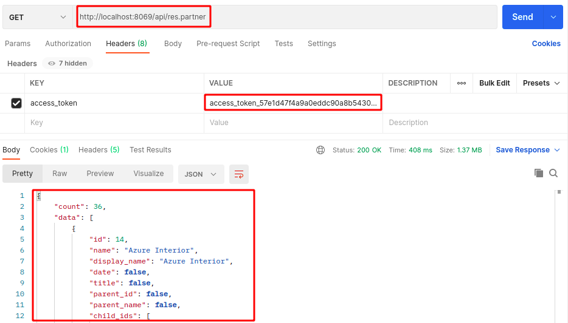

# Instalación ERP - Oddo:13 - Local - Contenedores Docker

* Crear archivo ```docker-compose.yml``` este archivo contiene la configuración para crear múltiples contenedores
``` yaml
version: '2'
services: 
  web:
    image: odoo:13.0
    depends_on: 
      - mydb
    ports:
      - "8069:8069"
    restart: always
    environment: 
      - HOST=mydb
      - USER=odoo
      - PASSWORD=odoopw

  mydb:
    image: postgres:12-alpine
    ports:
      - "5432:5432"
    restart: always
    environment:
      - POSTGRES_DB=postgres
      - POSTGRES_PASSWORD=odoopw
      - POSTGRES_USER=odoo
```

* Dentro del directorio del archivo .yml ejecutar el comando ```docker-compose up -d``` este comando permite crear los contenedores definidos

## Creación de la base de datos

* Una vez levantados los contenedores en el navegador ingresar la siguiente URL ```http://localhost:8069/``` que al iniciar presentará la siguiente pantalla para la configuración inicial de la base de datos:

<div align="center">
  
  <!---->
</div>

* Una vez creada la base de datos se presenta la página inicial con todas las aplicaciones disponibles en el marketplace de Odoo:13
* Para activar el modo desarrollador en Odoo se debe agregar web?debug=1 en URL como se observa en la imagen:

<div align="center">
  
  <!---->
</div>

## Instalar el módulo de contactos - Partners
* Para instalar el módulo se debe escribir Conatados en la barra de búsqueda y presionar el botón instalar

<div align="center">
  
  <!---->
</div>

* Una vez instalado el módulo se puede observar una lista de contactos con data ficticia.

## Instalar módulo de API REST

* Descargar el módulo de API REST del siguiente repositorio ```https://github.com/ajepe/odoo-addons``` en .zip de la rama 13.0 en este caso
* Una vez descargado el archivo .zip descomprimir el archivo, abrir una terminal dentro del nuevo directorio por ejemplo se vería algo así  :

<div align="center">
  
  <!---->
</div>

* Una vez dentro del directorio vamos a copiar la carpeta resful y pasarla dentro del directorio extra-addons que se encuentra en el contendor de Odoo 13

  <li>Ejecutar el siguiente comando para obtener el ID DEL CONETENEDOR <code>$ docker ps</code></li>
  <li>Ejecutar el siguiente comando para copiar la carapeta resful dentro del contenedor <code>$ docker cp ${pwd}/restful a014c4cc9f15:/mnt/extra-addons</code></li>
  <li>Para verificar que el directorio resful esta dentro del contenor ejecutar el comando <code>$ docker exec -ti <id_container> bash</code>, una vez dentro del contenor buscar dentro del directorio /mnt/extra-addons la carpeta restful</li>


* En necesario reiniciar los contenedores creados con docker compose, con el siguiente comando: ``` docker-compose restart ``` para que se actulicen los nuevos modulos que se colocaron el en contenedor
* Ahora se debe instalar el módulo de API REST desde el UI de Odoo, primero se actulizan todas las aplicaciones y despues buscar la restful y presionar instalar
<div align="center">
  
  <!---->
</div>

Una vez realizados todos los pasos anteriores es posible acceder a todos los módulos de Odoo mendiante API REST

## Configuración del API REST

* Para enlazar el API REST con los modelos de los módulos de Odoo es necesario obtner un token, enviando por el body, el nombre de la base de datos, correo y contraseña debe ser la mismas que se establecieron al momento de crear la base de datoscomo se observa el siguiente imagen:

<div align="center">
  
  <!---->
</div>

* Con este token se puede realizar diferentes peticiones HTTP (GET, POST, UPDATE, DELETE), siempre se debe enviar por los headers el token de acceso, como se observa en la imagen:

<div align="center">
  
  <!---->
</div>


